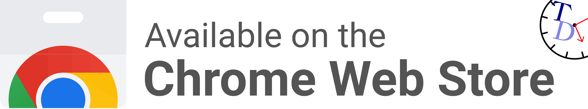
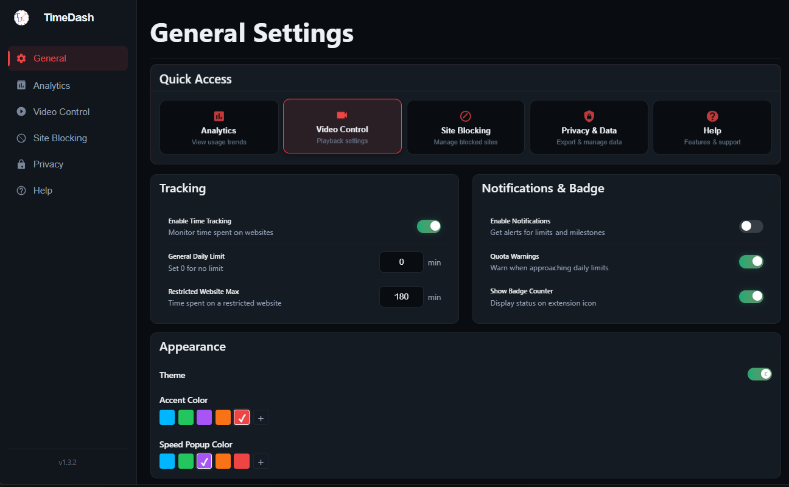
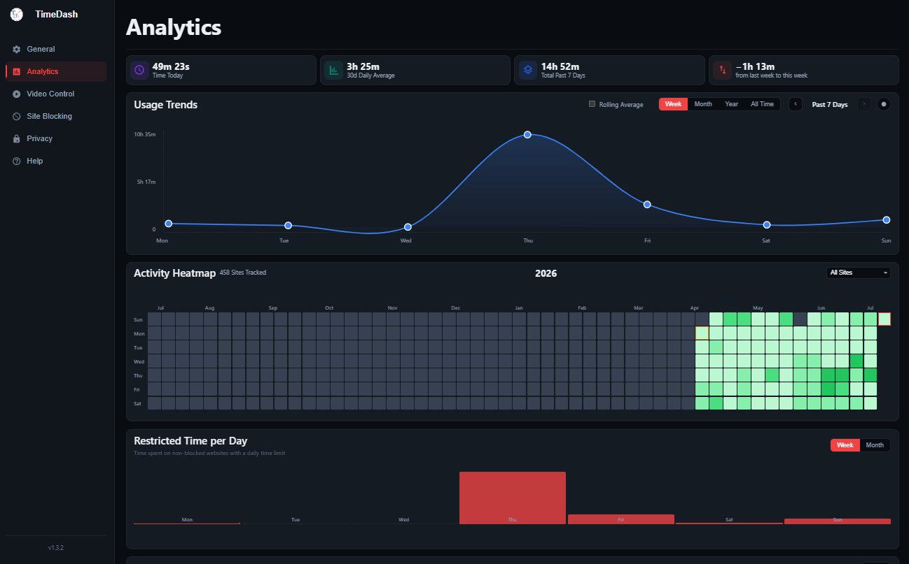
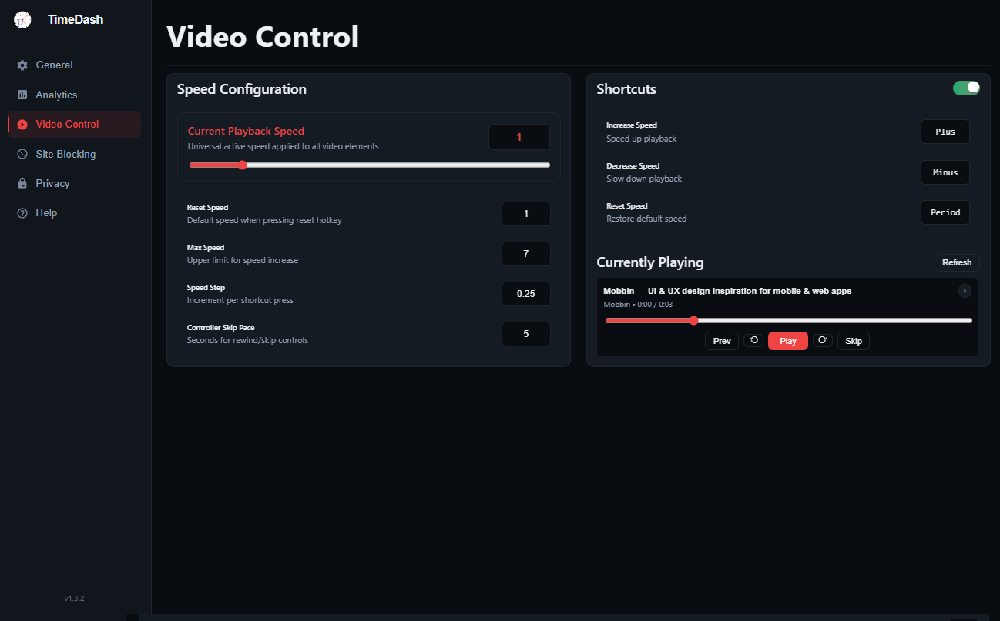
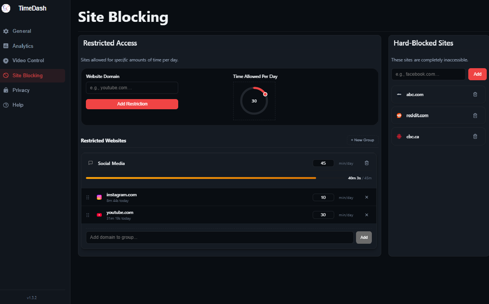

# TimeDash

[](https://chromewebstore.google.com/detail/timedash/fjlmkflcggcdndmchnmggldjdmmmpdgb)


Boost your productivity with strict time tracking, site blocking, analytics, advanced video playback controls.

## Features

| | |
|:---:|:---:|
|  |  |
|  |  |

- **Strict Time Tracking:** Accurately logs your time only on active, focused tabs. Idle, minimized, or background tabs won't skew your productivity data.
- **Activity Heatmap & Analytics:** Visualize your browsing habits with a GitHub-style heatmap, rolling 7-day usage charts, top sites lists, and daily averages.
- **Site Blocking & Restrictions:** Block distracting sites entirely, or set daily time limits (e.g., 30 minutes of YouTube per day) that automatically lock you out once exceeded.
- **Budget Groups (Site Groups):** Bundle multiple sites (e.g., social media) under a shared daily time budget. Supports custom icon selection and full drag-and-drop management:
  - Drag domains into groups or between groups.
  - Reorder domains within a group with live position markers.
- **Video Speed Controller:** Easily control HTML5 video playback speed across the web using customizable keyboard shortcuts or the extension popup.
- **Data Privacy:** Everything is stored locally in your browser. No external servers, no cloud sync, completely private.

## Running Locally

If you'd like to run the extension from source, follow these steps:

1. **Clone the repository:**
   ```bash
   git clone https://github.com/intelligent-username/TimeDash.git
   cd TimeDash
   ```

2. **Install dependencies:**
   *(Used solely for linting and formatting tooling)*
   ```bash
   npm install
   ```

3. **Load the extension into Chrome:**
   - Open your Chromium-based browser and navigate to `chrome://extensions/`.
   - Enable **"Developer mode"** in the top right corner.
   - Click **"Load unpacked"** in the top left corner.
   - Select the `TimeDash` project folder.

The extension will now be installed and active in your browser. Any changes you make to the code can be applied by clicking the "Refresh" icon on the extension card in `chrome://extensions/`.

## License

This project is licensed under the [MIT LICENSE](LICENSE) file for details.
