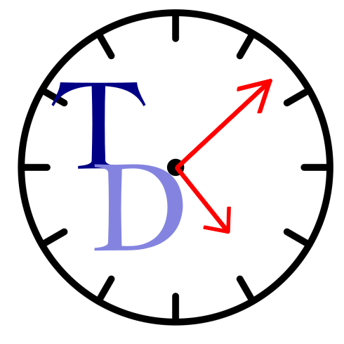

# TimeDash

Download the extension from the [Chrome Web Store](https://chromewebstore.google.com/detail/timedash/fjlmkflcggcdndmchnmggldjdmmmpdgb?utm_source=item-share-cb) or load it unpacked from this repository to start managing your time online with personalized rules, real-time stats, and motivational cues.

## Features

- Custom blocked and restricted rules let the background rule manager indicated by warnings and blocks.
- Global and site-specific daily limits.
- Popup surfaces live stats, a curated site list, and quick toggles for speed, tracking, and site blocking.
- Alarm manager for keeping timers accurate even when the browser is idle.

## Getting started

1. Run `npm install` from the project root to populate the tooling used for linting and docs.
2. Open a Chromium-based browser, go to `chrome://extensions`, enable developer mode, and click "Load unpacked" to point to this repository.
3. (Optional) Use `npm run lint` to validate the JS style before packaging or releasing.

## License

This project is licensed under the [MIT LICENSE](LICENSE) file for details.
